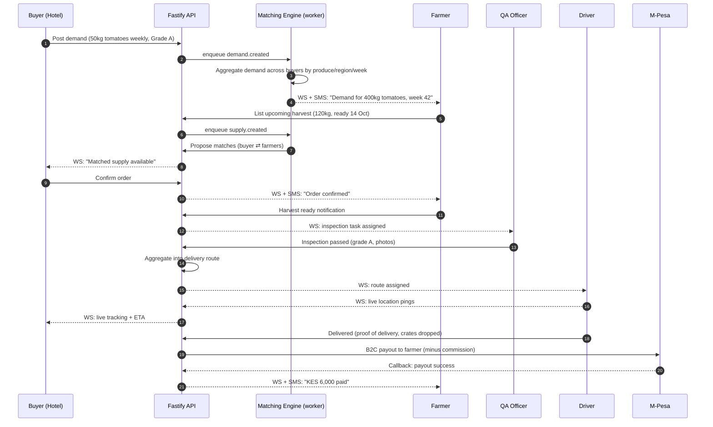
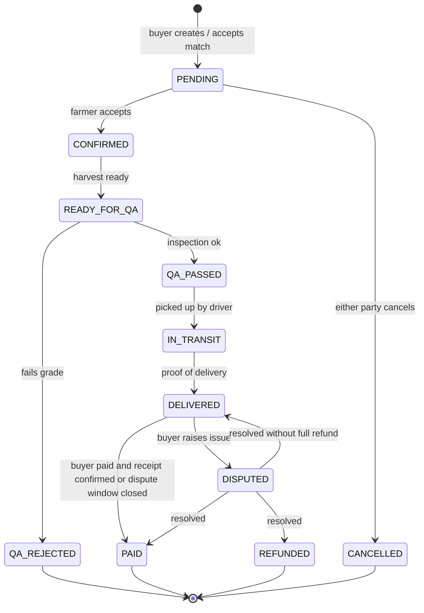
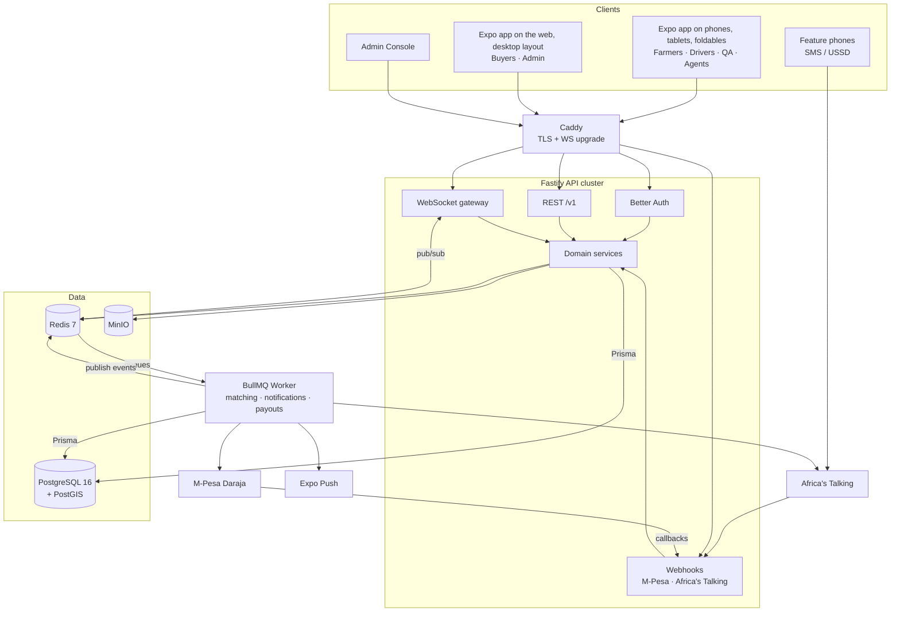
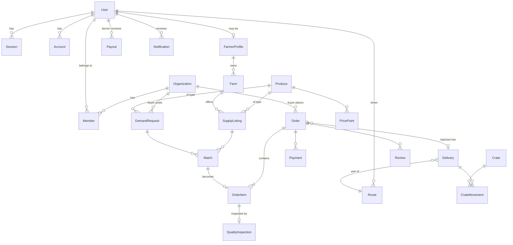

# FarmGo Connect: Technical Plan

> A youth-led, demand-led digital agribusiness platform by **EYAAM** that connects smallholder farmers and youth-owned agri-enterprises directly with hotels, restaurants, guesthouses and other institutional food buyers in Kenya.

**Stack at a glance:** TypeScript everywhere · **Fastify** API · **Prisma** ORM · **PostgreSQL (local, self-hosted, no Supabase)** · **Better Auth** · **WebSockets** (real-time) · Redis · BullMQ · MinIO · **Expo universal app** (Android, iOS and web: phone, tablet, foldable and desktop layouts) · M-Pesa Daraja · Africa's Talking (SMS/USSD) · Docker Compose

---

## Table of Contents

1. [What We Are Building](#1-what-we-are-building)
2. [Users & Roles](#2-users--roles)
3. [The Core Flow](#3-the-core-flow-demand-led-supply)
4. [System Architecture](#4-system-architecture)
5. [Tech Stack & Why](#5-tech-stack--why)
6. [Monorepo Structure](#6-monorepo-structure)
7. [Backend Design (Fastify)](#7-backend-design-fastify)
8. [Authentication (Better Auth)](#8-authentication-better-auth)
9. [Database Design (Prisma + Postgres)](#9-database-design-prisma--postgres)
10. [Real-Time Layer (WebSockets)](#10-real-time-layer-websockets)
11. [Background Jobs & Matching Engine](#11-background-jobs--matching-engine)
12. [Payments (M-Pesa)](#12-payments-m-pesa)
13. [Notifications, SMS & USSD](#13-notifications-sms--ussd)
14. [File Storage](#14-file-storage-minio)
15. [Frontend Apps](#15-frontend-apps)
16. [API Surface](#16-api-surface)
17. [Security](#17-security)
18. [Local Dev & Deployment](#18-local-development--deployment)
19. [Testing & Quality](#19-testing--quality)
20. [Observability](#20-observability)
21. [Roadmap](#21-roadmap)
22. [Open Questions](#22-open-questions)

---

## 1. What We Are Building

**The problem (from the proposal):**

- Farmers produce without knowing what the market will need → price pressure and waste.
- Hotels & restaurants rely on fragmented, multi-intermediary procurement → wasted time, inconsistent quality and delivery.
- Surplus produce is lost when supply exceeds immediate demand.
- Young people are excluded from higher-value agri-services.

**The innovation:** not "farmers and hotels on an app", but a **demand-led supply network**.

```
 TRADITIONAL                         FARMGO CONNECT
 ───────────                         ──────────────
 Farmer ─▶ Produce ─▶ Search          Buyer Demand
                      for Buyer            │
                                           ▼
                                     Demand Aggregation
                                           │
                                           ▼
                                     Farmer Production
                                           │
                                           ▼
                                     Harvest Notification
                                           │
                                           ▼
                                     Digital Order
                                           │
                                           ▼
                                     Quality Verification
                                           │
                                           ▼
                                        Delivery
                                           │
                                           ▼
                                        Payment
```

**Platform goals mapped to features:**

| Proposal goal | Platform feature |
|---|---|
| Demand-based production | Buyers post recurring / forecast demand; farmers see an aggregated demand board |
| Reduced food losses | Upcoming-harvest listings matched to buyers *before* harvest; surplus alerts |
| Transparent pricing | Public price index per produce/region, price history charts |
| Quality assurance | QA inspection records with photos, grading, rejection reasons |
| Efficient logistics | Order aggregation into delivery routes, live driver tracking |
| Reusable packaging | Crate tracking (issued → at buyer → returned) with deposits |
| Green youth enterprises | Input marketplace: compost, organic fertiliser, seedlings |
| Youth employment | Role-based staff tools: onboarding agents, QA officers, logistics, support |

---

## 2. Users & Roles

```
                          ┌──────────────────────┐
                          │     SUPER ADMIN       │  EYAAM platform team
                          └──────────┬───────────┘
                                     │
     ┌──────────────┬───────────────┼───────────────┬───────────────┐
     ▼              ▼               ▼               ▼               ▼
┌─────────┐   ┌───────────┐  ┌─────────────┐  ┌───────────┐  ┌──────────────┐
│ FARMER  │   │  BUYER    │  │ AGGREGATOR /│  │ QA OFFICER│  │  LOGISTICS / │
│         │   │ (hotel,   │  │ FIELD AGENT │  │           │  │  DRIVER      │
│ lists   │   │ restaurant│  │ onboards    │  │ inspects, │  │ collects &   │
│ produce │   │ guesthouse│  │ farmers,    │  │ grades    │  │ delivers     │
│         │   │ posts     │  │ collects on │  │ produce   │  │              │
│         │   │ demand)   │  │ their behalf│  │           │  │              │
└─────────┘   └───────────┘  └─────────────┘  └───────────┘  └──────────────┘
                                     │
                              ┌──────┴───────┐
                              │ INPUT SUPPLIER│  youth-owned green enterprises
                              │ compost,      │  (fertiliser, seedlings,
                              │ seedlings     │   packaging)
                              └──────────────┘
```

- **Organizations** (Better Auth `organization` plugin): a hotel is an org with members (owner, procurement manager, chef); a farmer group / cooperative is an org too.
- A user can have **one platform role** plus **org membership roles**.

---

## 3. The Core Flow (Demand-Led Supply)



**Order state machine:**



State transitions are enforced **server-side only** in a single `orderStateMachine` module. No route may set `status` directly.

---

## 4. System Architecture

### 4.1 High-level

```
┌──────────────────────────────────────────────────────────────────────────────────┐
│                                     CLIENTS                                       │
│                                                                                    │
│  ┌──────────────────┐  ┌──────────────────┐  ┌───────────────┐  ┌──────────────┐  │
│  │  Expo app on      │  │  Expo app on the  │  │ Admin area of │  │ Feature phone│  │
│  │  phones & tablets │  │  web (desktop)    │  │ the Expo app  │  │ SMS / USSD   │  │
│  │  Farmers, Drivers,│  │  Buyers, farmers  │  │ EYAAM staff   │  │ *384*xx#     │  │
│  │  QA, Agents       │  │  on laptops       │  │               │  │              │  │
│  └────────┬─────────┘  └────────┬─────────┘  └───────┬───────┘  └──────┬───────┘  │
└───────────┼─────────────────────┼────────────────────┼─────────────────┼──────────┘
            │  HTTPS (REST) + WSS │                    │                 │
            ▼                     ▼                    ▼                 ▼
┌──────────────────────────────────────────────────────────────┐  ┌──────────────────┐
│                     CADDY (reverse proxy)                     │  │ Africa's Talking │
│            TLS · HTTP/2 · WebSocket upgrade · gzip            │◀─│  webhooks        │
└──────────────────────────────┬───────────────────────────────┘  └──────────────────┘
                               │
                               ▼
┌──────────────────────────────────────────────────────────────────────────────────┐
│                          FASTIFY API  (Node.js, N instances)                      │
│                                                                                    │
│  ┌────────────┐ ┌────────────┐ ┌────────────┐ ┌────────────┐ ┌────────────────┐   │
│  │ Better Auth│ │ REST routes│ │ WS gateway │ │ Webhooks   │ │ Zod schemas +  │   │
│  │ /api/auth/*│ │ /v1/*      │ │ /ws        │ │ M-Pesa, AT │ │ OpenAPI (Swagger)│ │
│  └─────┬──────┘ └─────┬──────┘ └─────┬──────┘ └─────┬──────┘ └────────────────┘   │
│        └──────────────┴──────┬───────┴──────────────┘                              │
│                              ▼                                                     │
│              ┌───────────────────────────────┐                                     │
│              │  Services (domain logic)       │                                     │
│              │  orders · demand · supply ·    │                                     │
│              │  matching · qa · logistics ·   │                                     │
│              │  payments · crates · pricing   │                                     │
│              └───────┬───────────────┬───────┘                                     │
└──────────────────────┼───────────────┼─────────────────────────────────────────────┘
                       │               │
          ┌────────────┘               └─────────────┐
          ▼                                          ▼
┌───────────────────┐   ┌───────────────────┐   ┌────────────────────┐
│  POSTGRESQL 16     │   │      REDIS 7       │   │   MinIO (S3 API)    │
│  + PostGIS         │   │  • WS pub/sub fan- │   │  produce photos,    │
│  (local, Docker)   │   │    out across API  │   │  QA evidence, POD,  │
│  via Prisma        │   │    instances       │   │  ID documents       │
│                    │   │  • BullMQ queues   │   │                     │
│  source of truth   │   │  • rate limiting   │   │  presigned URLs     │
└─────────┬─────────┘   │  • cache           │   └────────────────────┘
          │             └─────────┬─────────┘
          │                       │
          │                       ▼
          │   ┌──────────────────────────────────────────────┐
          └──▶│          WORKER (Node.js, BullMQ)             │
              │  • matching engine      • SMS / push sending  │
              │  • demand aggregation   • M-Pesa payouts      │
              │  • route batching       • price index rollups │
              │  • harvest reminders    • crate return nudges │
              └──────────────┬───────────────────────────────┘
                             │
              ┌──────────────┼───────────────────┐
              ▼              ▼                   ▼
     ┌────────────────┐ ┌──────────────┐ ┌──────────────────┐
     │ M-Pesa Daraja   │ │Africa's      │ │ Expo Push (FCM/  │
     │ STK Push / B2C  │ │Talking SMS   │ │ APNs)            │
     └────────────────┘ └──────────────┘ └──────────────────┘
```

### 4.2 Same thing in Mermaid



### 4.3 Architectural principles

1. **Modular monolith first.** One Fastify app, split into domain modules with clear boundaries. Extract services only if load demands it.
2. **Postgres is the source of truth.** Redis is disposable (cache, pub/sub, queues).
3. **Write → event → fan-out.** Every state change writes to Postgres in a transaction, then publishes a domain event to Redis. WebSockets, SMS and push are *consumers* of those events, never inline in the request.
4. **Offline-tolerant clients.** Farmers are on 2G/3G with intermittent signal: the mobile app queues writes locally and syncs.
5. **Everything typed end-to-end.** Zod schemas in a shared package generate TS types for API and clients.
6. **Self-hostable.** Every dependency runs in Docker locally. No Supabase, no vendor lock-in.

---

## 5. Tech Stack & Why

| Layer | Choice | Why |
|---|---|---|
| Language | **TypeScript 5** (strict) | One language across API, workers, web, mobile |
| Runtime | **Node.js 22 LTS** | Stable, native `fetch`, good WS perf |
| Monorepo | **pnpm workspaces + Turborepo** | Shared types/schemas, cached builds |
| API framework | **Fastify 5** | Fast, schema-first, great plugin model, first-class WS |
| Validation | **Zod** + `fastify-type-provider-zod` | Single schema → validation + TS types + OpenAPI |
| API docs | `@fastify/swagger` + Scalar UI | Auto-generated from Zod schemas |
| ORM | **Prisma 6** | Type-safe queries, migrations, great DX |
| Database | **PostgreSQL 16** (local Docker) + **PostGIS** | Relational integrity, geo-queries for farm ↔ buyer distance |
| Auth | **Better Auth** | Self-hosted, Prisma adapter, phone OTP, organizations, admin, RBAC |
| Real-time | **`@fastify/websocket`** (ws) + **Redis pub/sub** | Native WS, horizontally scalable via Redis |
| Queue / jobs | **BullMQ** on Redis | Retries, delays, cron (repeatable jobs), rate limiting |
| Cache / rate-limit | **Redis 7** + `@fastify/rate-limit` | Shared across instances |
| File storage | **MinIO** (S3-compatible) | Self-hosted; swap to any S3 later without code change |
| Payments | **M-Pesa Daraja API** (STK Push, B2C) | The payment rail in Kenya |
| SMS / USSD | **Africa's Talking** | Reaches farmers without smartphones |
| Push | **Expo Push Notifications** | Simple FCM/APNs wrapper |
| App (all clients) | **Expo (React Native) + Expo Router**, universal: Android, iOS and web | One codebase for every role; responsive layouts for phone, tablet, foldable and desktop |
| Shared domain logic | **`packages/core`** | Matching, orders, payments, logistics and notifications used by both the API and the worker |
| Client data | **TanStack Query** | Caching, optimistic updates, WS-driven invalidation |
| Offline (mobile) | **WatermelonDB** or MMKV-backed outbox | Queue writes while offline |
| Maps | **MapLibre** + OpenStreetMap tiles | Free, no Google Maps billing |
| Charts | **Recharts** | Price trends, demand forecasts |
| i18n | `i18next`: **English + Kiswahili** | Farmer accessibility |
| Logging | **Pino** (built into Fastify) | Structured JSON logs |
| Monitoring | **OpenTelemetry** → Grafana / Loki / Tempo, **Sentry** | Traces, logs, errors |
| Testing | **Vitest**, **Testcontainers**, **Playwright** | Unit, integration on real Postgres, E2E |
| Lint/format | **Biome** (or ESLint + Prettier) | Fast, one tool |
| Reverse proxy | **Caddy** | Auto TLS, WS upgrade out of the box |
| Containers | **Docker Compose** | Local + single-VPS production |
| CI | **GitHub Actions** | Lint, typecheck, test, build images |

---

## 6. Monorepo Structure

```
farmgo-connect/
├── apps/
│   ├── api/                      # Fastify HTTP + WebSocket server
│   │   ├── src/
│   │   │   ├── server.ts         # buildApp() + listen
│   │   │   ├── app.ts            # registers plugins & modules
│   │   │   ├── plugins/          # prisma, redis, auth, ws, swagger, rate-limit, s3
│   │   │   ├── modules/
│   │   │   │   ├── users/
│   │   │   │   ├── farms/
│   │   │   │   ├── produce/      # catalog: tomatoes, kales, onions...
│   │   │   │   ├── supply/       # farmer listings (available + upcoming)
│   │   │   │   ├── demand/       # buyer requirements (one-off + recurring)
│   │   │   │   ├── matching/
│   │   │   │   ├── orders/       # + orderStateMachine.ts
│   │   │   │   ├── qa/
│   │   │   │   ├── logistics/    # routes, deliveries, tracking
│   │   │   │   ├── crates/       # reusable packaging
│   │   │   │   ├── payments/     # M-Pesa
│   │   │   │   ├── pricing/      # price index
│   │   │   │   ├── inputs/       # green inputs marketplace
│   │   │   │   ├── notifications/
│   │   │   │   ├── ussd/
│   │   │   │   └── admin/
│   │   │   │       # each module: routes.ts · service.ts · schemas.ts · events.ts · *.test.ts
│   │   │   ├── realtime/         # ws gateway, channel auth, redis bridge
│   │   │   └── lib/              # errors, pagination, money, phone utils
│   │   └── Dockerfile
│   ├── worker/                   # BullMQ processors
│   │   └── src/jobs/             # matching, notify, payout, aggregate-demand, price-rollup
│   └── app/                      # Expo universal app (Android, iOS, web): every role,
│                                 #   phone / tablet / foldable / desktop layouts
├── packages/
│   ├── db/                       # prisma/schema.prisma, migrations, seed, exported client
│   ├── auth/                     # Better Auth config shared by api + clients
│   ├── contracts/                # Zod schemas + WS event types (shared API contract)
│   ├── core/                     # domain logic + providers shared by api and worker
│   ├── sdk/                      # typed REST + WS client used by the app
│   ├── ui/                       # shared React Native components and design tokens
│   └── config/                   # env validation
├── infra/
│   ├── docker-compose.yml        # postgres, redis, minio, mailpit
│   ├── docker-compose.prod.yml
│   ├── Caddyfile
│   └── grafana/
├── .github/workflows/ci.yml
├── turbo.json
├── pnpm-workspace.yaml
└── PLAN.md
```

**Dependency rule:**

```
apps/app ──▶ packages/sdk, packages/ui ──▶ packages/contracts

apps/api ─┐
apps/worker┴──▶ packages/core ──▶ packages/db, packages/auth, packages/contracts
```

Clients never import `packages/db`. The API never imports from `apps/*`.

---

## 7. Backend Design (Fastify)

### 7.1 Request lifecycle

```
Request
  │
  ▼
onRequest ──▶ requestId, rate-limit (Redis), CORS
  │
  ▼
preHandler ──▶ auth.getSession() → req.user, req.session, req.activeOrg
  │            requireRole('BUYER') / requirePermission('order:create')
  ▼
validation ──▶ Zod (body, params, query)
  │
  ▼
handler ──▶ service.method(ctx, input)
  │            └─ prisma.$transaction([...writes, outbox insert])
  ▼
onSend ────▶ serialize via Zod response schema (strips unknown fields)
  │
  ▼
onResponse ─▶ pino log + OTel span end
```

### 7.2 Module pattern

```ts
// apps/api/src/modules/demand/routes.ts
export default async function demandRoutes(app: FastifyInstance) {
  app.withTypeProvider<ZodTypeProvider>().post('/v1/demand', {
    preHandler: [app.requireRole('BUYER')],
    schema: {
      body: CreateDemandInput,        // from @farmgo/contracts
      response: { 201: DemandDto },
      tags: ['demand'],
    },
  }, async (req, reply) => {
    const demand = await demandService.create(req.ctx, req.body);
    return reply.code(201).send(demand);
  });
}
```

```ts
// apps/api/src/modules/demand/service.ts
export async function create(ctx: Ctx, input: CreateDemandInput) {
  return ctx.prisma.$transaction(async (tx) => {
    const demand = await tx.demandRequest.create({ data: { ...input, buyerOrgId: ctx.orgId } });
    await tx.outboxEvent.create({ data: { type: 'demand.created', payload: { id: demand.id } } });
    return demand;
  });
}
```

### 7.3 Transactional outbox (reliable events)

Writing to Postgres and publishing to Redis are two systems. If the process dies in between, events are lost. The **outbox pattern** fixes this:

```
 ┌──────────── one Postgres transaction ────────────┐
 │  INSERT order ...                                 │
 │  INSERT outbox_event (type='order.confirmed')     │
 └───────────────────────────────────────────────────┘
                        │
                        ▼
        Outbox relay (worker, polls every 500ms
        or LISTEN/NOTIFY) ── SELECT ... FOR UPDATE SKIP LOCKED
                        │
          ┌─────────────┼─────────────────┐
          ▼             ▼                 ▼
   Redis PUBLISH   BullMQ job:       BullMQ job:
   (→ WebSockets)  send SMS/push     run matching
                        │
                        ▼
              mark outbox_event.processedAt
```

### 7.4 Error handling

One `AppError` class (`code`, `httpStatus`, `message`, `details`) and a global `setErrorHandler` that maps Prisma errors (`P2002` unique → 409, `P2025` not found → 404) and Zod errors (→ 400) into a consistent shape:

```json
{ "error": { "code": "ORDER_INVALID_TRANSITION", "message": "Cannot move from PAID to IN_TRANSIT", "requestId": "..." } }
```

---

## 8. Authentication (Better Auth)

### 8.1 Why Better Auth

Self-hosted, stores everything in **our** Postgres via the Prisma adapter, and has plugins for exactly what we need.

| Plugin | Used for |
|---|---|
| `phoneNumber` | **Primary login for farmers**: OTP over SMS (Africa's Talking). Many farmers have no email. |
| `emailAndPassword` | Buyers / hotel staff and admins |
| `organization` | Hotels & farmer cooperatives with members, invites, org roles |
| `admin` | Ban/impersonate users, set platform roles |
| `access` (RBAC) | Fine-grained permissions (`order:create`, `qa:inspect`...) |
| `bearer` / `expo` | Mobile app sessions (token stored in SecureStore) |
| `twoFactor` | Mandatory for admin accounts |

### 8.2 Setup

```ts
// packages/auth/src/index.ts
import { betterAuth } from 'better-auth';
import { prismaAdapter } from 'better-auth/adapters/prisma';
import { phoneNumber, organization, admin, bearer, twoFactor } from 'better-auth/plugins';
import { expo } from '@better-auth/expo';
import { prisma } from '@farmgo/db';

export const auth = betterAuth({
  database: prismaAdapter(prisma, { provider: 'postgresql' }),
  emailAndPassword: { enabled: true },
  session: { expiresIn: 60 * 60 * 24 * 30, cookieCache: { enabled: true, maxAge: 300 } },
  trustedOrigins: [process.env.WEB_URL!, 'farmgo://'],
  user: {
    additionalFields: {
      platformRole: { type: 'string', defaultValue: 'FARMER', input: false },
      preferredLanguage: { type: 'string', defaultValue: 'sw' },
      county: { type: 'string', required: false },
    },
  },
  plugins: [
    phoneNumber({
      sendOTP: async ({ phoneNumber, code }) => smsQueue.add('otp', { phoneNumber, code }),
      signUpOnVerification: { getTempEmail: (p) => `${p}@phone.farmgo.local` },
    }),
    organization(),
    admin(),
    bearer(),
    expo(),
    twoFactor(),
  ],
});
```

### 8.3 Mounting in Fastify

```ts
// apps/api/src/plugins/auth.ts
app.route({
  method: ['GET', 'POST'],
  url: '/api/auth/*',
  handler: async (req, reply) => {
    const url = new URL(req.url, `http://${req.headers.host}`);
    const res = await auth.handler(new Request(url, {
      method: req.method,
      headers: fromNodeHeaders(req.headers),
      body: req.body ? JSON.stringify(req.body) : undefined,
    }));
    reply.status(res.status);
    res.headers.forEach((v, k) => reply.header(k, v));
    return reply.send(res.body ? await res.text() : null);
  },
});

app.decorateRequest('user', null);
app.addHook('preHandler', async (req) => {
  const session = await auth.api.getSession({ headers: fromNodeHeaders(req.headers) });
  req.user = session?.user ?? null;
  req.session = session?.session ?? null;
});
```

### 8.4 Login flows

```
FARMER (phone)                               BUYER (email)
──────────────                               ─────────────
Enter +2547XXXXXXXX                          Email + password
     │                                             │
     ▼                                             ▼
POST /api/auth/phone-number/send-otp         POST /api/auth/sign-in/email
     │  └▶ BullMQ → Africa's Talking SMS           │
     ▼                                             ▼
Enter 6-digit code                           Session cookie (httpOnly,
     │                                        SameSite=Lax, Secure)
     ▼                                             │
POST /api/auth/phone-number/verify                 ▼
     │                                       Select active organization
     ▼                                       (e.g. "Serena Nairobi")
Bearer token → Expo SecureStore
```

**WebSocket auth** reuses the same session: the cookie (web) or `?token=` / `Sec-WebSocket-Protocol` bearer (mobile) is validated with `auth.api.getSession()` during the upgrade. No separate WS auth system.

---

## 9. Database Design (Prisma + Postgres)

### 9.1 Entity-relationship diagram



### 9.2 Prisma schema (core, abridged)

```prisma
// packages/db/prisma/schema.prisma
generator client {
  provider        = "prisma-client-js"
  previewFeatures = ["postgresqlExtensions"]
}

datasource db {
  provider   = "postgresql"
  url        = env("DATABASE_URL")
  extensions = [postgis, pg_trgm]
}

// ─── Better Auth tables (generated by `npx @better-auth/cli generate`) ───
model User {
  id                String   @id
  name              String
  email             String   @unique
  emailVerified     Boolean  @default(false)
  phoneNumber       String?  @unique
  phoneNumberVerified Boolean @default(false)
  image             String?
  platformRole      PlatformRole @default(FARMER)
  preferredLanguage String   @default("sw")
  county            String?
  banned            Boolean? @default(false)
  createdAt         DateTime @default(now())
  updatedAt         DateTime @updatedAt

  sessions      Session[]
  accounts      Account[]
  members       Member[]
  farmerProfile FarmerProfile?
  driverRoutes  Route[]        @relation("DriverRoutes")
  payouts       Payout[]
  notifications Notification[]
}
// Session, Account, Verification, Organization, Member, Invitation (per Better Auth CLI)

enum PlatformRole {
  FARMER
  BUYER
  AGENT
  QA_OFFICER
  DRIVER
  INPUT_SUPPLIER
  ADMIN
}

// ─── Domain ───
model FarmerProfile {
  id          String  @id @default(cuid())
  userId      String  @unique
  user        User    @relation(fields: [userId], references: [id])
  isYouth     Boolean @default(false)      // impact reporting (18 to 35)
  gender      String?
  mpesaNumber String
  onboardedBy String?                      // agent userId
  farms       Farm[]
}

model Farm {
  id          String  @id @default(cuid())
  farmerId    String
  farmer      FarmerProfile @relation(fields: [farmerId], references: [id])
  name        String
  county      String
  ward        String?
  location    Unsupported("geography(Point,4326)")?
  acreage     Decimal? @db.Decimal(8, 2)
  isOrganic   Boolean  @default(false)
  listings    SupplyListing[]
  @@index([county])
}

model Produce {
  id        String @id @default(cuid())
  name      String @unique           // "Tomatoes"
  nameSw    String                   // "Nyanya"
  category  ProduceCategory
  unit      Unit                     // KG, CRATE, BUNCH, PIECE
  grades    String[]                 // ["A","B","C"]
  imageUrl  String?
}

enum ProduceCategory { VEGETABLE FRUIT HERB GRAIN DAIRY POULTRY INPUT }
enum Unit { KG CRATE BUNCH PIECE LITRE TRAY }

model SupplyListing {
  id            String   @id @default(cuid())
  farmId        String
  farm          Farm     @relation(fields: [farmId], references: [id])
  produceId     String
  produce       Produce  @relation(fields: [produceId], references: [id])
  quantity      Decimal  @db.Decimal(10, 2)
  quantityLeft  Decimal  @db.Decimal(10, 2)
  grade         String?
  pricePerUnit  Int                        // KES cents, never floats for money
  availableFrom DateTime                   // future date = upcoming harvest
  availableTo   DateTime
  status        ListingStatus @default(OPEN)
  photos        String[]                   // MinIO object keys
  matches       Match[]
  createdAt     DateTime @default(now())
  @@index([produceId, status, availableFrom])
}

enum ListingStatus { DRAFT OPEN PARTIALLY_MATCHED FULLY_MATCHED EXPIRED CANCELLED }

model DemandRequest {
  id             String   @id @default(cuid())
  buyerOrgId     String
  produceId      String
  produce        Produce  @relation(fields: [produceId], references: [id])
  quantity       Decimal  @db.Decimal(10, 2)
  minGrade       String?
  maxPricePerUnit Int?
  neededBy       DateTime
  recurrence     String?                   // RRULE, e.g. "FREQ=WEEKLY;BYDAY=MO"
  deliveryLocation Unsupported("geography(Point,4326)")?
  status         DemandStatus @default(OPEN)
  matches        Match[]
  createdAt      DateTime @default(now())
  @@index([produceId, status, neededBy])
}

enum DemandStatus { OPEN PARTIALLY_FILLED FILLED EXPIRED CANCELLED }

model Match {
  id          String  @id @default(cuid())
  demandId    String
  demand      DemandRequest @relation(fields: [demandId], references: [id])
  listingId   String
  listing     SupplyListing @relation(fields: [listingId], references: [id])
  quantity    Decimal @db.Decimal(10, 2)
  score       Float                        // matching engine score
  status      MatchStatus @default(PROPOSED)
  orderItem   OrderItem?
  @@unique([demandId, listingId])
}

enum MatchStatus { PROPOSED ACCEPTED REJECTED EXPIRED }

model Order {
  id           String   @id @default(cuid())
  code         String   @unique                 // "FG-24-000123"
  buyerOrgId   String
  status       OrderStatus @default(PENDING)
  subtotal     Int                               // KES cents
  deliveryFee  Int
  commission   Int
  total        Int
  deliveryId   String?
  delivery     Delivery? @relation(fields: [deliveryId], references: [id])
  items        OrderItem[]
  payments     Payment[]
  reviews      Review[]
  version      Int      @default(0)              // optimistic locking
  createdAt    DateTime @default(now())
  updatedAt    DateTime @updatedAt
  @@index([buyerOrgId, status])
}

enum OrderStatus {
  PENDING CONFIRMED READY_FOR_QA QA_PASSED QA_REJECTED
  IN_TRANSIT DELIVERED DISPUTED PAID REFUNDED CANCELLED
}

model OrderItem {
  id           String @id @default(cuid())
  orderId      String
  order        Order  @relation(fields: [orderId], references: [id])
  matchId      String? @unique
  match        Match?  @relation(fields: [matchId], references: [id])
  listingId    String
  quantity     Decimal @db.Decimal(10, 2)
  pricePerUnit Int
  inspection   QualityInspection?
}

model QualityInspection {
  id           String   @id @default(cuid())
  orderItemId  String   @unique
  orderItem    OrderItem @relation(fields: [orderItemId], references: [id])
  inspectorId  String
  grade        String
  passed       Boolean
  acceptedQty  Decimal  @db.Decimal(10, 2)
  notes        String?
  photos       String[]
  inspectedAt  DateTime @default(now())
}

model Route {
  id         String   @id @default(cuid())
  driverId   String
  driver     User     @relation("DriverRoutes", fields: [driverId], references: [id])
  date       DateTime
  status     String   @default("PLANNED")
  deliveries Delivery[]
}

model Delivery {
  id           String   @id @default(cuid())
  routeId      String
  route        Route    @relation(fields: [routeId], references: [id])
  sequence     Int
  eta          DateTime?
  deliveredAt  DateTime?
  podPhoto     String?                          // proof of delivery
  signatureKey String?
  orders       Order[]
  crateMoves   CrateMovement[]
}

model Crate {
  id        String @id @default(cuid())
  qrCode    String @unique
  status    CrateStatus @default(IN_STOCK)
  holderId  String?                             // user or org currently holding
  movements CrateMovement[]
}

enum CrateStatus { IN_STOCK WITH_FARMER IN_TRANSIT WITH_BUYER LOST RETIRED }

model CrateMovement {
  id         String   @id @default(cuid())
  crateId    String
  crate      Crate    @relation(fields: [crateId], references: [id])
  deliveryId String?
  delivery   Delivery? @relation(fields: [deliveryId], references: [id])
  from       CrateStatus
  to         CrateStatus
  scannedBy  String
  at         DateTime @default(now())
}

model Payment {
  id              String   @id @default(cuid())
  orderId         String
  order           Order    @relation(fields: [orderId], references: [id])
  method          String                        // MPESA_STK, BANK, INVOICE
  amount          Int
  status          String                        // PENDING, SUCCESS, FAILED
  mpesaReceipt    String?  @unique
  checkoutRequestId String? @unique
  idempotencyKey  String   @unique
  raw             Json?
  createdAt       DateTime @default(now())
}

model Payout {
  id             String @id @default(cuid())
  farmerId       String
  farmer         User   @relation(fields: [farmerId], references: [id])
  amount         Int
  status         String
  mpesaReceipt   String? @unique
  conversationId String? @unique
  idempotencyKey String  @unique
  createdAt      DateTime @default(now())
}

model PricePoint {
  id        String   @id @default(cuid())
  produceId String
  produce   Produce  @relation(fields: [produceId], references: [id])
  county    String
  avgPrice  Int
  minPrice  Int
  maxPrice  Int
  week      DateTime
  @@unique([produceId, county, week])
}

model Notification {
  id        String   @id @default(cuid())
  userId    String
  user      User     @relation(fields: [userId], references: [id])
  type      String
  title     String
  body      String
  data      Json?
  channels  String[]                            // ["ws","push","sms"]
  readAt    DateTime?
  createdAt DateTime @default(now())
  @@index([userId, readAt])
}

model Review {
  id        String @id @default(cuid())
  orderId   String
  order     Order  @relation(fields: [orderId], references: [id])
  authorId  String
  targetId  String
  rating    Int
  comment   String?
}

model OutboxEvent {
  id          BigInt    @id @default(autoincrement())
  type        String
  payload     Json
  createdAt   DateTime  @default(now())
  processedAt DateTime?
  attempts    Int       @default(0)
  @@index([processedAt, id])
}

model AuditLog {
  id        BigInt   @id @default(autoincrement())
  actorId   String?
  action    String
  entity    String
  entityId  String
  before    Json?
  after     Json?
  ip        String?
  createdAt DateTime @default(now())
  @@index([entity, entityId])
}
```

### 9.3 Database rules

- **Money is integer KES cents** (`Int`). Never `Float`.
- **Quantities** use `Decimal`.
- **Geo** via PostGIS `geography(Point)`; distance queries through `prisma.$queryRaw` with `ST_DWithin` / `ST_Distance`.
- **Optimistic locking** on `Order.version` to prevent concurrent state changes.
- **Soft deletes** only where audit matters (orders, payments never hard-deleted).
- **Migrations:** `prisma migrate dev` locally, `prisma migrate deploy` in CI/CD. Never `db push` in production.
- **Backups:** nightly `pg_dump` + WAL archiving (pgBackRest) to off-site storage; test restores monthly.
- **Seed:** produce catalog (EN/SW), counties, demo farmers/buyers for dev.

---

## 10. Real-Time Layer (WebSockets)

### 10.1 What is real-time

| Event | Who receives it |
|---|---|
| `demand.aggregated` | Farmers who grow that produce in that region |
| `match.proposed` | The buyer org + the farmer |
| `order.status_changed` | Buyer org members, farmer, assigned QA/driver |
| `qa.task_assigned` | QA officer |
| `route.assigned` | Driver |
| `delivery.location` | Buyer tracking that delivery (throttled, every ~10s) |
| `payment.settled` / `payout.sent` | Buyer / farmer |
| `price.updated` | Anyone viewing the price board |
| `notification.new` | Individual user (bell badge) |
| `chat.message` | Participants of an order thread (phase 2) |

### 10.2 Scaling WebSockets across instances

A user's socket is connected to *one* API instance, but the event may be produced by *another* instance or the worker. Redis pub/sub bridges them:

```
                    ┌─────────────── Redis ───────────────┐
                    │   channels:                          │
                    │   user:{id}   org:{id}   order:{id}  │
                    │   delivery:{id}   prices:{county}    │
                    └───▲─────────────┬─────────────┬─────┘
          PUBLISH       │             │ SUBSCRIBE   │ SUBSCRIBE
   ┌────────────────────┴──┐    ┌─────▼──────┐ ┌────▼───────┐
   │ Worker / any API node │    │ API node 1 │ │ API node 2 │
   │ (outbox relay)        │    │            │ │            │
   └───────────────────────┘    │ local map: │ │ local map: │
                                │ channel →  │ │ channel →  │
                                │ Set<socket>│ │ Set<socket>│
                                └──┬───┬─────┘ └────┬───────┘
                                   │   │            │
                               phone  web          phone
                               farmer buyer        driver
```

Each API node subscribes to a Redis channel only while it has at least one local socket interested in it (ref-counted).

### 10.3 Protocol

Single endpoint: `wss://api.farmgo.co.ke/ws`

```jsonc
// client → server
{ "op": "subscribe",   "channel": "order:ckx123" }
{ "op": "unsubscribe", "channel": "order:ckx123" }
{ "op": "ping" }
{ "op": "location",    "deliveryId": "d1", "lat": -1.29, "lng": 36.82 }   // drivers only

// server → client
{ "op": "event", "channel": "order:ckx123", "type": "order.status_changed",
  "data": { "status": "IN_TRANSIT" }, "seq": 1042, "ts": "2026-10-14T08:12:00Z" }
{ "op": "pong" }
{ "op": "error", "code": "FORBIDDEN_CHANNEL" }
```

- **Auto-subscribed** on connect: `user:{id}` and `org:{activeOrgId}`.
- **Channel authorization:** every `subscribe` is checked (`canSubscribe(user, channel)`): a buyer can only join `order:*` channels for their own org's orders.
- **Heartbeat:** server ping every 25s; drop sockets that miss 2.
- **Reconnect & catch-up:** client reconnects with exponential backoff, sends `lastSeq`; server replays missed events from a short Redis Stream buffer, otherwise client refetches via REST (TanStack Query invalidation).
- **WebSockets are notification, not source of truth.** Clients always treat REST as authoritative; WS events trigger cache updates/invalidation.

### 10.4 Implementation sketch

```ts
// apps/api/src/realtime/gateway.ts
app.register(fastifyWebsocket, { options: { maxPayload: 16 * 1024 } });

app.get('/ws', { websocket: true }, async (socket, req) => {
  const session = await auth.api.getSession({ headers: wsHeaders(req) });
  if (!session) return socket.close(4401, 'unauthorized');

  const conn = hub.register(socket, session.user);
  conn.join(`user:${session.user.id}`);
  if (session.session.activeOrganizationId) conn.join(`org:${session.session.activeOrganizationId}`);

  socket.on('message', async (raw) => {
    const msg = ClientMessage.safeParse(JSON.parse(raw.toString()));
    if (!msg.success) return conn.send({ op: 'error', code: 'BAD_MESSAGE' });
    switch (msg.data.op) {
      case 'subscribe':
        if (await canSubscribe(session.user, msg.data.channel)) conn.join(msg.data.channel);
        else conn.send({ op: 'error', code: 'FORBIDDEN_CHANNEL' });
        break;
      case 'location':
        await logistics.recordLocation(session.user, msg.data); // rate-limited, publishes delivery:{id}
        break;
      case 'ping': conn.send({ op: 'pong' }); break;
    }
  });

  socket.on('close', () => hub.unregister(conn));
});
```

---

## 11. Background Jobs & Matching Engine

### 11.1 Queues (BullMQ)

| Queue | Jobs | Trigger |
|---|---|---|
| `outbox` | relay outbox → Redis pub/sub + other queues | continuous |
| `matching` | `match-demand`, `match-supply` | on `demand.created`, `supply.created` |
| `demand` | `aggregate-weekly`, `expand-recurring` | cron: daily 02:00 EAT |
| `notify` | `sms`, `push`, `email` | domain events |
| `payments` | `stk-timeout-check`, `b2c-payout`, `reconcile` | events + cron |
| `logistics` | `build-routes` | cron: 16:00 EAT for next-day deliveries |
| `pricing` | `rollup-price-index` | cron: weekly |
| `reminders` | `harvest-reminder`, `crate-return-nudge`, `listing-expiry` | cron |

All jobs are **idempotent** (keyed by entity id + action) with exponential backoff retries and a dead-letter queue visible in **Bull Board** (mounted at `/admin/queues`, admin only).

### 11.2 Matching engine (v1: rule-based, explainable)

```
For each OPEN demand D:
  candidates = SupplyListings where
      produce       = D.produce
      status        IN (OPEN, PARTIALLY_MATCHED)
      availableFrom <= D.neededBy  AND availableTo >= D.neededBy - 2 days
      grade         >= D.minGrade
      price         <= D.maxPrice (if set)
      ST_DWithin(farm.location, D.deliveryLocation, 80 km)

  score(listing) =  0.35 * distanceScore        (closer = better, less transport + emissions)
                  + 0.25 * priceScore           (cheaper relative to price index)
                  + 0.20 * reliabilityScore     (farmer's QA pass rate + on-time history)
                  + 0.10 * freshnessScore       (harvest date close to neededBy)
                  + 0.10 * inclusionBoost       (youth / women farmers, new farmers)

  Greedily allocate quantity from highest score until D.quantity is filled,
  preferring fewer farmers per order (simpler aggregation).
  → create Match rows (PROPOSED) → events → buyer + farmers notified
```

**v2:** demand forecasting per produce/county from historical orders (simple seasonal moving averages first; ML only once there is data).

### 11.3 Route batching

Nightly job groups `QA_PASSED` orders for tomorrow by area, orders stops by nearest-neighbour heuristic (OSRM self-hosted for road distances later), and assigns to available drivers. Fewer trips = the "efficient logistics" green goal.

---

## 12. Payments (M-Pesa)

```
 BUYER PAYS                                         FARMER GETS PAID
 ──────────                                         ────────────────
 Buyer taps "Pay"                                   Order → DELIVERED (+ QA accepted qty)
     │                                                   │
     ▼                                                   ▼
 POST /v1/orders/:id/pay                            payout job (BullMQ)
     │  idempotencyKey                                   │ amount = accepted qty × price
     ▼                                                   │          − platform commission
 Daraja STK Push ──▶ phone prompt ──▶ PIN               ▼
     │                                              Daraja B2C request
     ▼                                                   │
 POST /webhooks/mpesa/stk  (callback)                    ▼
     │  verify source IP + validate payload         POST /webhooks/mpesa/b2c/result
     │  upsert Payment by CheckoutRequestID              │
     ▼                                                   ▼
 Payment SUCCESS → order event → WS + SMS          Payout SUCCESS → WS + SMS to farmer
```

- **Escrow-style settlement.** The buyer's payment is held after delivery. The order settles to `PAID`, and the farmer's B2C payout is sent, only when the buyer confirms receipt or the dispute window (48 hours, configurable) closes. QA-rejected quantity and dispute refunds come off the farmer's payout.
- **Hotels often pay on invoice (net 7/14/30).** Support `INVOICE` payment method with statements; platform may pre-finance farmer payouts (phase 3, needs a finance partner).
- Every callback is **idempotent** (unique `mpesaReceipt` / `checkoutRequestId`).
- A `reconcile` cron uses the Transaction Status API for any payment stuck `PENDING` > 2 minutes.
- Ledger-style `Payment` and `Payout` rows are never updated in place after `SUCCESS`; adjustments are new rows.

---

## 13. Notifications, SMS & USSD

### 13.1 Channel routing

```
 domain event
      │
      ▼
 notify service ── decides channels per user preferences + importance
      │
      ├──▶ WebSocket  (if online)          free, instant
      ├──▶ Expo Push  (if app installed)   free
      ├──▶ SMS        (Africa's Talking)   costs money → only important events
      └──▶ Email      (buyers, invoices)
      │
      ▼
 Notification row saved (in-app inbox)
```

Templates are in **English and Kiswahili**; SMS templates kept ≤160 chars.

### 13.2 USSD (farmers without smartphones)

```
*384*123#
 ┌──────────────────────────┐
 │ FarmGo Connect           │
 │ 1. Uza mazao (Sell)      │ ──▶ choose produce → qty → ready date → confirm
 │ 2. Mahitaji (Demand)     │ ──▶ top demand in your county this week
 │ 3. Oda zangu (My orders) │ ──▶ latest 3 orders + status
 │ 4. Bei (Prices)          │ ──▶ this week's price for a produce
 │ 5. Malipo (Payments)     │
 └──────────────────────────┘
```

Africa's Talking posts each step to `POST /webhooks/ussd`; session state stored in Redis (TTL 3 min); the handler calls the same domain services as the REST API.

---

## 14. File Storage (MinIO)

- Buckets: `produce-photos`, `qa-evidence`, `proof-of-delivery`, `kyc` (private).
- Upload flow: client asks API for a **presigned PUT URL** → uploads directly to MinIO → sends object key back to API. The API never proxies large files.
- Images are resized/compressed **client-side** before upload (farmers pay for data).
- Reads via short-lived presigned GET URLs; public produce photos can be served through Caddy with caching.
- MinIO is S3-compatible → can move to AWS S3 / Cloudflare R2 by changing env vars only.

---

## 15. Frontend App (Expo, every screen size)

One **Expo universal app** (Expo Router) runs on Android, iOS and the web. The signed-in user's role decides which areas they see. The backend is the same for every client.

### 15.1 Who uses what

| Role | Main devices | Key screens |
|---|---|---|
| **Farmers** | Low-end Android phones (plus USSD) | Demand board, list produce (photo + qty + date), matches to accept, my orders, payouts |
| **Drivers, QA officers, field agents** | Phones, some tablets | Route + map + crate QR scan, QA checklist with photos, onboard a farmer |
| **Buyers (hotels, restaurants)** | Desktop web and tablets | Post one-off and recurring demand, browse supply, accept matches, live order tracking, invoices, price trends, team |
| **EYAAM admins** | Desktop web | Users and KYC, disputes, match overrides, routes, crates, payments, jobs, impact dashboard |

### 15.2 Layouts for every screen

| Width class | Examples | Layout |
|---|---|---|
| Compact (< 600 dp) | Phones, folded foldables | Bottom tabs, single column, large touch targets |
| Medium (600 to 1023 dp) | Tablets, unfolded foldables, small laptops | Navigation rail, list + detail side by side |
| Expanded (≥ 1024 dp) | Desktop web, large tablets in landscape | Sidebar, multi-column dashboards, data tables |

- Breakpoints come from the current window size (`useWindowDimensions`), never the device type. A foldable switches layout live as it opens and closes.
- Foldables: respect the hinge. Keep content off the fold in two-pane layouts.
- The web build supports keyboard navigation, hover states, and URLs that can be shared and bookmarked.

### 15.3 Client data flow

```
 ┌───────────────────────── React component ─────────────────────────┐
 │  useQuery(['orders', id])  ◀────── invalidate / setQueryData ─────┐│
 └──────────┬─────────────────────────────────────────────────────────┘│
            │ fetch                                                    │
            ▼                                                          │
   @farmgo/sdk  REST client  (typed from @farmgo/contracts)            │
            │                                                          │
            ▼                                                          │
      Fastify /v1/*                                                    │
                                                                       │
   @farmgo/sdk  WS client ── on 'order.status_changed' ────────────────┘
      (auto-reconnect, resubscribe, lastSeq catch-up)
```

### 15.4 Mobile-first for low connectivity

- **Offline outbox**: listing creation, QA results and delivery confirmations are saved locally first and synced when online (each with a client-generated idempotency key).
- **Small bundles & images**, skeleton screens, cached catalog and price data.
- **Large touch targets, icons + Kiswahili**, minimal typing (steppers for quantity, date chips).
- The web build doubles as a fallback for farmers who won't install the app.

---

## 16. API Surface

Base: `https://api.farmgo.co.ke` · Docs: `/docs` (Scalar, generated from Zod)

```
AUTH (Better Auth)
  POST   /api/auth/phone-number/send-otp
  POST   /api/auth/phone-number/verify
  POST   /api/auth/sign-in/email
  POST   /api/auth/sign-out
  GET    /api/auth/get-session
  POST   /api/auth/organization/create | set-active | invite-member ...

PROFILE & FARMS
  GET    /v1/me
  PATCH  /v1/me
  POST   /v1/farmers                       (agent onboards a farmer)
  GET    /v1/farms            POST /v1/farms           PATCH /v1/farms/:id

CATALOG & PRICES
  GET    /v1/produce
  GET    /v1/prices?produceId=&county=&weeks=12

SUPPLY (farmers)
  GET    /v1/supply?produceId=&county=&from=&to=
  POST   /v1/supply
  PATCH  /v1/supply/:id
  POST   /v1/supply/:id/harvest-ready

DEMAND (buyers)
  GET    /v1/demand                        (buyer: own · farmer: aggregated board)
  GET    /v1/demand/board?county=          (aggregated, anonymised)
  POST   /v1/demand
  PATCH  /v1/demand/:id

MATCHES
  GET    /v1/matches
  POST   /v1/matches/:id/accept
  POST   /v1/matches/:id/reject

ORDERS
  GET    /v1/orders            GET /v1/orders/:id
  POST   /v1/orders
  POST   /v1/orders/:id/transition         { to: "CONFIRMED" }
  POST   /v1/orders/:id/pay
  POST   /v1/orders/:id/dispute
  POST   /v1/orders/:id/review

QA
  GET    /v1/qa/tasks
  POST   /v1/qa/inspections

LOGISTICS
  GET    /v1/routes/today                  (driver)
  POST   /v1/deliveries/:id/complete       (POD photo, signature, crates)
  POST   /v1/crates/scan

INPUTS MARKETPLACE (green enterprises)
  GET    /v1/inputs        POST /v1/inputs       POST /v1/inputs/:id/order

UPLOADS
  POST   /v1/uploads/presign

NOTIFICATIONS
  GET    /v1/notifications       POST /v1/notifications/read

ADMIN
  /v1/admin/*                               (users, KYC, overrides, reports, impact metrics)

WEBHOOKS
  POST   /webhooks/mpesa/stk
  POST   /webhooks/mpesa/b2c/result
  POST   /webhooks/mpesa/b2c/timeout
  POST   /webhooks/ussd
  POST   /webhooks/sms/delivery-report

REALTIME
  GET    /ws   (WebSocket upgrade)

HEALTH
  GET    /health/live    GET /health/ready  (checks Postgres + Redis)
```

---

## 17. Security

| Area | Measure |
|---|---|
| Sessions | Better Auth httpOnly, `Secure`, `SameSite=Lax` cookies; bearer tokens in Expo SecureStore |
| Authorization | RBAC checks in `preHandler` **plus** row-level ownership checks in services (buyer can only see own org's orders) |
| Input | Zod on every route and every WS message; response schemas strip internal fields |
| Rate limiting | `@fastify/rate-limit` on Redis, strict on OTP send (per phone + per IP) to stop SMS pumping fraud |
| Headers | `@fastify/helmet`, strict CORS allow-list |
| Webhooks | M-Pesa callbacks: Safaricom IP allow-list + secret path token + idempotency; never trust amounts without querying status |
| Secrets | `.env` never committed; validated at boot with Zod (`packages/config/env.ts`); Docker secrets in prod |
| Data protection | Kenya **Data Protection Act 2019**: consent at signup, data minimisation, KYC docs in private bucket, right to deletion, register with ODPC |
| Audit | `AuditLog` for admin actions, order transitions, payment changes |
| Admins | Mandatory 2FA, impersonation logged |
| DB | Least-privilege Postgres role for the app (no superuser), TLS if DB on another host |
| Dependencies | Renovate + `pnpm audit` in CI |

---

## 18. Local Development & Deployment

### 18.1 Local stack

The real files are `infra/docker-compose.yml` and `.env.example`; the README has the full walkthrough. Host ports are offset so they don't clash with other local projects: Postgres **5440**, Redis **6390**, MinIO **9010/9011**, Mailpit **8030**.

```bash
pnpm install
cp .env.example .env
pnpm infra:up       # Postgres + PostGIS, Redis, MinIO, Mailpit
pnpm db:migrate     # apply migrations and generate the Prisma client
pnpm db:seed        # produce catalog + demo marketplace
pnpm dev            # API :4000 and worker
```

In development, SMS/OTP is logged to the console instead of sent, and M-Pesa uses a local stand-in (switch `MPESA_PROVIDER=daraja` to use the Daraja sandbox through a `cloudflared` / `ngrok` tunnel for callbacks).

### 18.2 Production (phase 1: single VPS, simple & cheap)

```
                        Internet
                           │
                  ┌────────▼────────┐
                  │  Caddy :443      │  auto TLS (Let's Encrypt)
                  └──┬─────┬─────┬──┘
     api.farmgo.co.ke│     │     │admin.farmgo.co.ke
                     │     │app.farmgo.co.ke
          ┌──────────▼┐ ┌──▼─────┐ ┌▼───────┐
          │ api ×2    │ │ web    │ │ admin  │
          └─────┬─────┘ └────────┘ └────────┘
                │
     ┌──────────┼───────────┬─────────────┐
     ▼          ▼           ▼             ▼
 ┌────────┐ ┌───────┐ ┌──────────┐ ┌──────────┐
 │postgres│ │ redis │ │  minio   │ │ worker ×1│
 └───┬────┘ └───────┘ └──────────┘ └──────────┘
     │
     ▼
 pgBackRest → off-site backup
```

- Host: a VPS in/near Kenya for latency (e.g. a Nairobi region provider) or Hetzner/DigitalOcean, 4 vCPU / 8 GB to start.
- Deploy: GitHub Actions builds Docker images → pushes to GHCR → SSH `docker compose pull && up -d` (or **Coolify / Dokploy** for a UI).
- Zero-downtime: 2 API containers behind Caddy, rolling restart.
- `prisma migrate deploy` runs as a one-off container before the new API starts.
- Mobile: **EAS Build** + **EAS Update** for OTA JS updates.

**Phase 2+ scaling path:** move Postgres to a dedicated managed/self-hosted server with a read replica, add more API nodes (WS already scales via Redis), then consider Kubernetes only if genuinely needed.

---

## 19. Testing & Quality

```
          ▲  E2E (Playwright + Detox/Maestro for mobile)
         ╱ ╲   buyer posts demand → farmer lists → order → deliver → paid
        ╱───╲
       ╱     ╲  Integration (Vitest + Testcontainers Postgres/Redis)
      ╱       ╲   Fastify app.inject() against real DB, WS tests with ws client
     ╱─────────╲
    ╱           ╲ Unit (Vitest)
   ╱             ╲  matching scores, order state machine, price math, USSD menus
  ╱───────────────╲
```

- **CI pipeline:** `lint → typecheck → unit → integration → build → (main) docker push → deploy`.
- Contract tests: SDK and API share `@farmgo/contracts`, so breaking changes fail typecheck.
- Seed-based **demo mode** for pitching to hotels/partners.
- Load test WS + order endpoints with **k6** before launch.

---

## 20. Observability

| Signal | Tool |
|---|---|
| Logs | Pino JSON → Loki (Grafana) |
| Traces | OpenTelemetry (Fastify, Prisma, ioredis, BullMQ instrumentation) → Tempo |
| Metrics | Prometheus: request latency, WS connections, queue depth, failed jobs, STK success rate |
| Errors | Sentry (API, web, mobile) |
| Uptime | Uptime Kuma (self-hosted) |
| Queues | Bull Board |
| **Impact metrics** (for EYAAM / funders) | Admin dashboard: farmers onboarded (youth/women %), buyers active, kg traded, kg matched pre-harvest (food loss avoided), farmer income, crates reused, youth jobs |

---

## 21. Roadmap

```mermaid
gantt
    title FarmGo Connect Delivery Plan
    dateFormat  YYYY-MM-DD
    axisFormat  %b %d

    section Phase 0 · Foundation
    Monorepo, Docker, CI, env config         :p0a, 2026-10-01, 7d
    Prisma schema v1 + seed                  :p0b, after p0a, 5d
    Better Auth (phone OTP, email, orgs)     :p0c, after p0a, 7d

    section Phase 1 · MVP marketplace
    Produce catalog, farms, supply listings  :p1a, after p0b, 10d
    Demand requests (one-off + recurring)    :p1b, after p0b, 10d
    Orders + state machine                   :p1c, after p1a, 10d
    WebSocket gateway + Redis fan-out        :p1d, after p0c, 10d
    Notifications (SMS, push, in-app)        :p1e, after p1d, 7d
    Buyer web app                            :p1f, after p1b, 14d
    Farmer mobile app                        :p1g, after p1a, 21d

    section Phase 2 · Operations
    Matching engine v1                       :p2a, after p1c, 10d
    QA inspections                           :p2b, after p1c, 7d
    Logistics: routes, driver app, tracking  :p2c, after p2b, 14d
    M-Pesa STK + B2C payouts                 :p2d, after p1c, 14d
    Admin console                            :p2e, after p1f, 14d

    section Phase 3 · Scale & Green
    USSD for feature phones                  :p3a, after p2d, 10d
    Reusable crate tracking (QR)             :p3b, after p2c, 7d
    Green inputs marketplace                 :p3c, after p2e, 10d
    Price index + demand forecasting         :p3d, after p2a, 14d
    Impact dashboard for funders             :p3e, after p3c, 7d

    section Launch
    Pilot: 5 hotels, 50 farmers (1 county)   :milestone, after p2e, 0d
```

**MVP definition (pilot-ready):** phone login, farmers list produce + upcoming harvests, hotels post demand, manual/assisted matching, orders with live status over WebSockets, SMS notifications, M-Pesa payment, admin console. Everything else is layered on after real usage data.

---

## 22. Open Questions

1. **Commission model:** % per order, subscription for hotels, or both? Who bears delivery cost?
2. **Payment terms:** do hotels pay upfront (STK) or on invoice? If invoice, who pre-finances farmers?
3. **Logistics:** own riders/vehicles, youth delivery enterprises, or third-party (e.g. Sendy-style) partners?
4. **Pilot geography:** which county first? (drives produce catalog, languages, route design)
5. **QA:** at farm gate, at an aggregation centre, or at the buyer's door?
6. **Crate deposits:** charged to buyers, farmers, or absorbed by the project?
7. **KYC depth:** national ID required for farmers to receive payouts?
8. **Hosting & data residency:** host in Kenya for compliance/latency, or EU VPS acceptable?

---

*Prepared for EYAAM · FarmGo Connect · Plan v0.1 · 2026-09-21*
